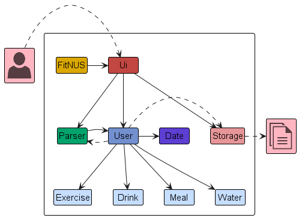
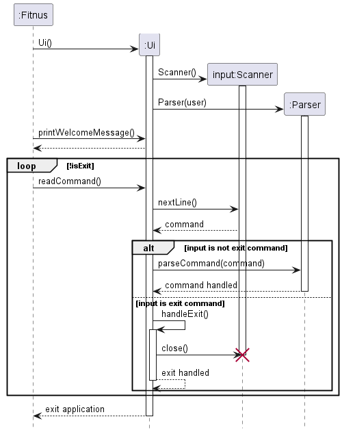
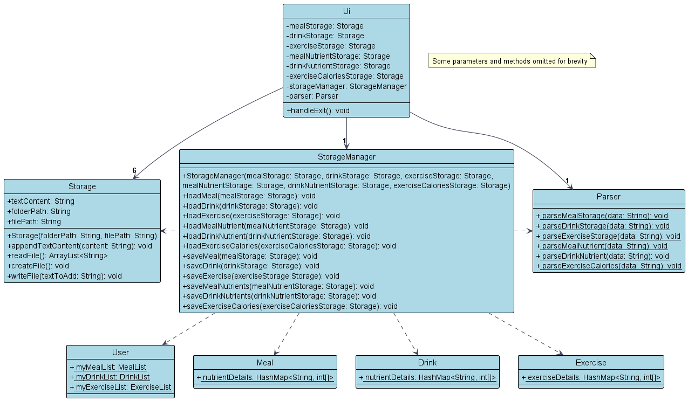
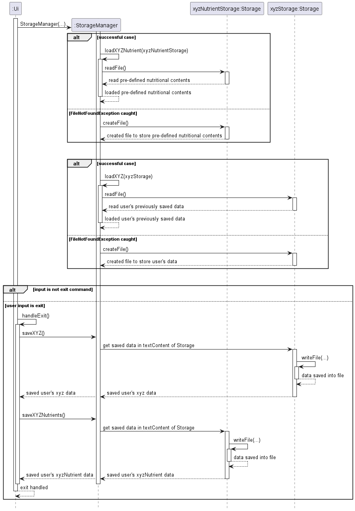
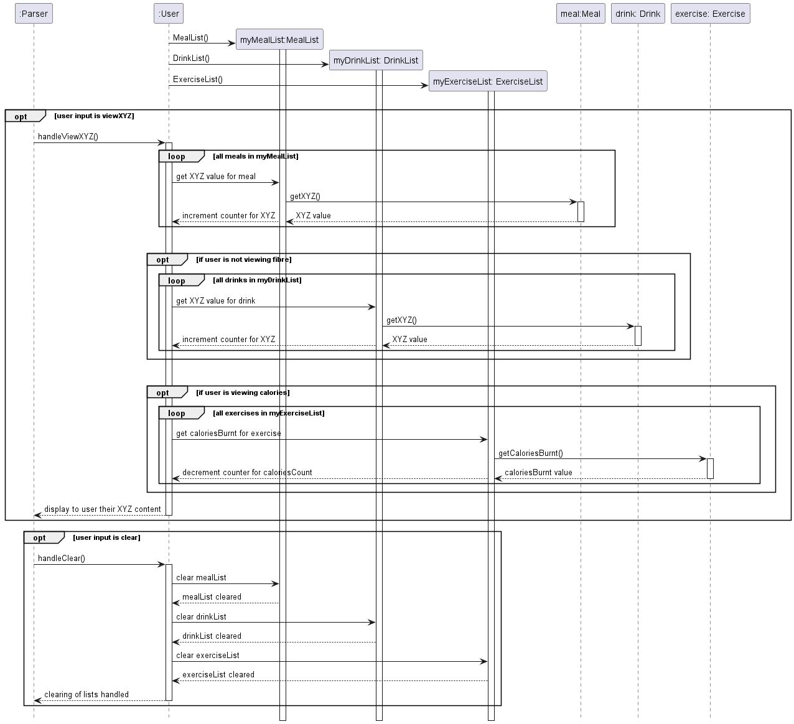
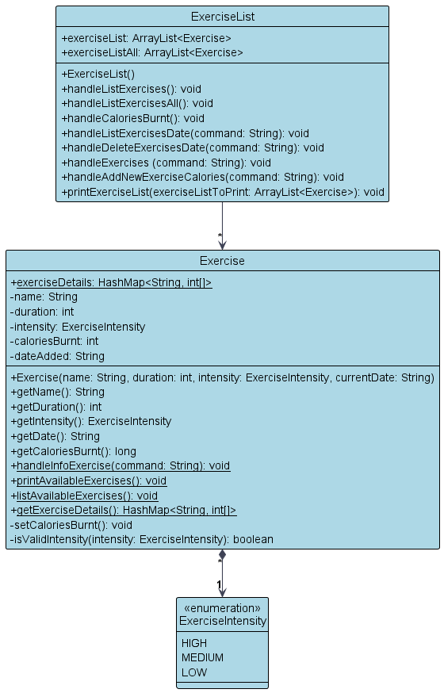
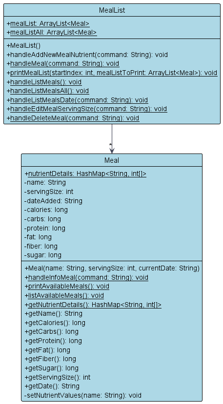
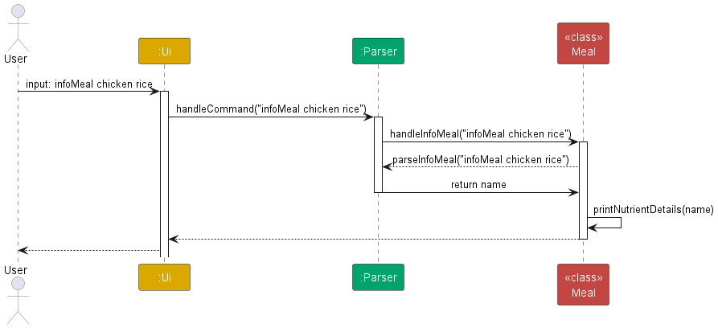

# Developer Guide

## Acknowledgements

Below are the references used on the project:
1. [Developer Guide](https://se-education.org/addressbook-level3/DeveloperGuide.html)
2. [User Guide](https://se-education.org/addressbook-level3/UserGuide.html)

## Design & implementation

### Architecture

The architecture diagram belows shows the overall design of our FitNUS CLI app and how each component interact with each other.

**Main Components of The Architecture**

- `FitNUS`: FitNUS main code which runs the program until termination
- `Ui`: The user interface of the app that reads in user input
- `Storage`: Handles storage of all `meal`, `drink` and `exercise` that the user has input
- `Parser`: Parses user input
- `User`: Handles user input and stores the `Exercise`, `Drink`, `Meal`, and `Water` created by user
- `Date`: Handles user's local machine date
- `ExerciseList`: Exercises completed and its duration created by user
- `DrinkList`: Drinks intake (including water) and its nutritional values created by user
- `MealList`: Meals intake and its nutritional values created by user

### Ui Component
#### Sequence Diagram
_Note: The following sequence diagram captures the interactions only between the Fitnus, Ui and Parser classes_

When the user first starts the application, the Ui class will be constructed. Within the Ui class, Scanner and Parser 
similarly will be constructed.

The Ui class will continuously read the user input:
- If the user input DOES NOT correspond to "exit", Ui will pass the user input to Parser class. Parser class will both 
  parse and handle the command.
- Else if the user input corresponds to "exit", Ui will handle the exit.

### Storage Component
#### Description
The Ui component will create a `StorageManager` to manage the reading and writing of the `Storage` (meal, drink, and exercise).
There are two types of data being stored, one to keep track of what the user has inputted to the app, and one to keep track
of the nutritional information of the known meal/drinks/exercise.

#### Implementation
- File Location:
  - The user's meal, drinks, and exercise data is stored into text files in 
  `./data/MealList.txt`, `./data/DrinkList.txt`, and `./data/ExerciseList.txt`, respectively. 
  - The nutritional information of all available meals, drinks, and exercises is stored into csv files in
  `./db/Meal_db.csv`, `./db/Drink_db.csv`, `./db/Exercise_db.csv`, respectively.
- Format:
  - All `Meal` objects in `MealList` will be formatted and stored in a string format of "`MEAL_NAME`,`SERVING_SIZE`,`DATE`"
  - All `Drink` objects in `DrinkList` will be formatted and stored in a string format of "`DRINK_NAME`,`SERVING_VOLUME`,`DATE`"
  - All `Exercise` objects in `ExerciseList` will be formatted and stored in a string format of "`EXERCISE_NAME`,`DURATION`,`INTENSITY`,`DATE`"
  - All meal nutrients are stored in the format of "`MEAL_NAME`,`CALORIES`,`CARBS`,`PROTEIN`,`FAT`,`FIBER`,`SUGAR`"
  - All drink nutrients are stored in the format of "`DRINK_NAME`,`CALORIES`,`CARBS`,`SUGAR`,`PROTEIN`,`FAT`"
  - All exercise information is stored in the format of "`EXERCISE_NAME`,`HIGH_INTENSITY`,`MEDIUM_INTENSITY`,`LOW_INTENSITY`"
- Loading: When the app starts, the `StorageManager` will load and parse all the nutrient information from the csv files and put it into 
a HashMap in the `Meal`, `Drink`, and `Exercise` class. However, if the csv files are not found, it will create a new csv file
and store some pre-defined contents. Then, `StorageManager` will load and parse all the user data from the txt files and append it
into list in the `MealList`, `DrinkList`, and `ExerciseList`. If the txt files are not found, it will create a new txt file.
- Writing: When the user enter the `exit` command, the `StorageManager` will retrieve all the `Meal`, `Drink`, and `Exercise` objects
from the list and format it into string. Then, it will append all the strings and write the files to the corresponding `Storage`.

#### Class Diagram

#### Sequence Diagram
_Note: The following sequence diagram captures the interactions only between the Ui, Storage and StorageManager 
classes when loading and saving data.  
XYZ is used as a placeholder for Meal / Drink / Exercise for diagram simplicity._ 

### User Component
#### Description
The User component will create MealList, DrinkList and ExerciseList for the user to track their data. Additionally, 
this component is in-charge of handling view, listEverything, recommend and clear commands.

#### Implementation
User Class:
- Attributes:
  - `myMealList:` Represents the user's class that managers the meal lists.
  - `myDrinkList:` Represents the user's class that managers the drink lists.
  - `myExerciseList:` Represents the user's class that managers the exercise lists.

- Methods:
  - `handleViewCalories()`: Prints the user's net calorie intake of the day.
  - `handleViewCarbohydrates()`: Prints the user's total carbohydrates intake of the day.
  - `handleViewProteins()`: Prints the user's total protein intake of the day.
  - `handleViewFiber()`: Prints the user's total fiber intake of the day.
  - `handleViewFat()`: Prints the user's total fat intake of the day.
  - `handleViewSugar()`: Prints the user's total sugar intake of the day.
  - `handleListEverything()`: Prints all meals and drinks that the user has inputted today.
  - `handleListEverythingAll()`: Prints all meals and drinks that the user has inputted of all-time.
  - `handleListEverythingDate()`: Prints all meals and drinks that the user has inputted on a specified date.
  - `handleClear()`: Clears all user's entries of the day.
  - `handleRecommendations()`: Give recommendations to the user based on their calorie and water intake.

#### Sequence Diagram
_Note: The following sequence diagram captures the interactions only between the User, MealList, DrinkList and 
ExerciseList classes._   

For diagram simplicity, the following choices were made when creating the diagram:
- Only optional blocks for handleViewXYZ() and handleClear() methods were created.   
  As such, methods within User such as 
  handleRecommendations() and handleListEverything()  were omitted.
- For methods where the user would like to view their nutrional content (handleViewXYZ), XYZ is used as a placeholder 
  for the specified nutritional content (e.g. calories, carbohydrates, protein etc.)

User class initialises MealList, DrinkList and ExerciseList for the user to track their data.

### Exercise Component

1. Upon starting up the application, User will call `loadExercises` to fetch all data from `ExerciseList.txt` and add it into `exerciseListAll`.
2. A `User` class consists of zero to as many `Exercise` objects in the ArrayList.
3. Each `Exercise` contains exactly one enumeration of `ExerciseIntensity`.
### Drink Component

### Meal Component

## Implementation

### Information on a Particular Meal Feature
The `infoMeal` feature is executed on the `User` class. Let's say we want to find out about the nutrient values of chicken rice.   
**Sample Input**: `infoMeal chicken rice`

### Tracking Exercise Feature
- Create a CSV which stores data regarding how many calories are burnt per hour for each exercise type (eg. swimming, running, cycling).
- Implement a 'track exercise' function which will be parsed with the format:
  track exercise t/{type of exercise} d/{duration of exercise}
- Parse the command
- Using a hashmap, access the data regarding the amount of calories burnt per hour for the given exercise and calculate the total calories burnt for the given duration.
- Store the total calories burnt through exercise in the User class

## Product scope
### Target user profile
- Have a need to manage their dietary intake and exercise routines effectively.
- Prefer desktop applications over other types of platforms.
- Can type quickly and prefer typing over mouse interactions.
- Are reasonably comfortable using command-line interface (CLI) applications.

### Value proposition

The fitness app aims to help users manage their dietary habits and exercise routines more efficiently compared to traditional GUI-driven apps. 
By offering a streamlined interface optimized for keyboard input and CLI interactions, users can track their meals, drinks, and exercises swiftly, allowing them to focus more on their fitness and nutritional goals and less on navigating through complex user interfaces.

## User Stories

| Priority | As a ... | I want to ...          | So that I can ...                                      |
|----------|----------|------------------------|--------------------------------------------------------|
| ***      |new user| see usage instructions | refer to them when I forget how to use the application |
| ***      |user| add a meal | track my daily calorie intake                          |

## Non-Functional Requirements

1. Should work on any mainstream OS (Linux, Windows, MacOS) as long as it has Java 11 or above installed.
2. A user with above average typing speed for regular English text (i.e. not code, not system admin commands) should be able to accomplish most of the tasks faster using commands than using the mouse.

## Glossary

* *meal* - Any food consumed.
* *drink* - Any beverage consumed.
* *exercise* - Any physical activity performed.
* *calories* - Measure of energy derived from food.
* *carbohydrates* - Macronutrient providing energy.
* *proteins* - Macronutrient essential for growth and repair.
* *fat* - Macronutrient important for energy storage and insulation.
* *sugar* - Simple carbohydrate often added to food for sweetness.
* *fiber* - Indigestible plant material aiding digestion.
* *water* - Essential liquid for hydration and bodily functions.

## Instructions for manual testing
Given below are instructions to test the app on your own device.
### Launch and Shutdown
1. Initial Launch
   1. Create an empty folder, download the jar file, and place the file inside the folder.
   2. Open the terminal and navigate to the folder you just created.
   3. Type `java -jar [name of the jar]`, e.g.`(java -jar FitNUS.jar)` on the CLI.
2. Window Preference
   1. Resize the window to an optimum size. Ideally full screen, as some text might not be displayed correctly.
3. App Features and Commands
4. Save and Shutdown
   1. Type `exit` to shut down the FitNUS app.
   2. Upon exiting, all entries inputted will be updated to the database locally.
