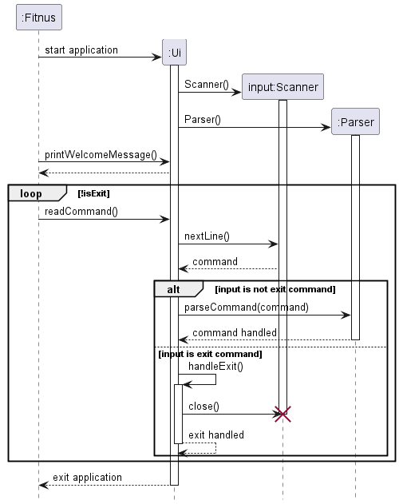

# Developer Guide

## Acknowledgements

Below are the references used on the project:
1. [Developer Guide](https://se-education.org/addressbook-level3/DeveloperGuide.html)
2. [User Guide](https://se-education.org/addressbook-level3/UserGuide.html)

## Design & implementation

### Architecture

The architecture diagram belows shows the overall design of our FitNUS CLI app and how each component interact with each other.

**Main Components of The Architecture**

- `FitNUS`: FitNUS main code which runs the program until termination
- `Ui`: The user interface of the app that reads in user input
- `Storage`: Handles stored all `recipe`, `ingredient` and `shortcut` that the user has input
- `Parser`: Parses user input
- `User`: Handles user input and stores the `Exercise`, `Drink`, `Meal`, and `Water` created by user
- `Date`: Handles user's local machine date
- `Exercise`: Exercises completed and its duration created by user
- `Drink`: Drinks intake and its nutritional values created by user
- `Meal`: Meals intake and its nutritional values created by user
- `Water`: Water intake created by user

### Ui Component
#### Sequence Diagram
_Note: The following sequence diagram captures the interactions only between the Fitnus, Ui and Parser classes_

When the user first starts the application, the Ui class will be constructed. Within the Ui class, Scanner and Parser 
similarly will be constructed.

The Ui class will continuously read the user input:
- If the user input DOES NOT correspond to "exit", Ui will pass the user input to Parser class. Parser class will both 
  parse and handle the command.
- Else if the user input corresponds to "exit", Ui will handle the exit.

### Exercise Component

1. Upon starting up the application, User will call `loadExercises` to fetch all data from `ExerciseList.txt` and add it into `exerciseListAll`.
2. A `User` class consists of zero to as many `Exercise` objects in the ArrayList.
3. Each `Exercise` contains exactly one enumeration of `ExerciseIntensity`.
### Drink Component

### Water Component

### Storage Component

## Implementation

### Information on a Particular Meal Feature
The `infoMeal` feature is executed on the `User` class. Let's say we want to find out about the nutrient values of chicken rice.   
**Sample Input**: `infoMeal chicken rice`

### Tracking Exercise Feature
- Create a CSV which stores data regarding how many calories are burnt per hour for each exercise type (eg. swimming, running, cycling).
- Implement a 'track exercise' function which will be parsed with the format:
  track exercise t/{type of exercise} d/{duration of exercise}
- Parse the command
- Using a hashmap, access the data regarding the amount of calories burnt per hour for the given exercise and calculate the total calories burnt for the given duration.
- Store the total calories burnt through exercise in the User class

### CSV Storage
- Create three CSV files for storing meal nutrients, drink nutrients, and exercise calories information.
- For each line in the CSV, parse the string with "," as the delimiter, with the first element being the name and the others being the nutrient/calories information 
- Save each description name and nutrient/calories information in the corresponding hashmap (meal, drink, and exercise) to be used by other functions. 

### Saved Meal, Drink, Exercises Storage
- Each meal object in the meal list corresponds to a string with a format of `meal_name,serving_size,date`
- Each drink object in the drink list corresponds to a string with a format of `drink_name,volume,date`
- Each exercise object in the exercise list corresponds to a string with a format of `exercise_name,duration,intensity,date`
- To store, convert all objects (meal, drink, exercise) in the list into its corresponding string, then write the appended strings into a .txt file
- To retrieve, parse each string using "," as its delimiter and convert it into its corresponding objects, then add all the entries to the object list (mealList, drinkList, exerciseList)

## Product scope
### Target user profile
- Have a need to manage their dietary intake and exercise routines effectively.
- Prefer desktop applications over other types of platforms.
- Can type quickly and prefer typing over mouse interactions.
- Are reasonably comfortable using command-line interface (CLI) applications.

### Value proposition

The fitness app aims to help users manage their dietary habits and exercise routines more efficiently compared to traditional GUI-driven apps. 
By offering a streamlined interface optimized for keyboard input and CLI interactions, users can track their meals, drinks, and exercises swiftly, allowing them to focus more on their fitness and nutritional goals and less on navigating through complex user interfaces.

## User Stories

| Priority | As a ... | I want to ...          | So that I can ...                                      |
|----------|----------|------------------------|--------------------------------------------------------|
| ***      |new user| see usage instructions | refer to them when I forget how to use the application |
| ***      |user| add a meal | track my daily calorie intake                          |

## Non-Functional Requirements

1. Should work on any mainstream OS (Linux, Windows, MacOS) as long as it has Java 11 or above installed.
2. A user with above average typing speed for regular English text (i.e. not code, not system admin commands) should be able to accomplish most of the tasks faster using commands than using the mouse.

## Glossary

* *meal* - Any food consumed.
* *drink* - Any beverage consumed.
* *exercise* - Any physical activity performed.
* *calories* - Measure of energy derived from food.
* *carbohydrates* - Macronutrient providing energy.
* *proteins* - Macronutrient essential for growth and repair.
* *fat* - Macronutrient important for energy storage and insulation.
* *sugar* - Simple carbohydrate often added to food for sweetness.
* *fiber* - Indigestible plant material aiding digestion.
* *water* - Essential liquid for hydration and bodily functions.

## Instructions for manual testing
Given below are instructions to test the app on your own device.
### Launch and Shutdown
1. Initial Launch
   1. Create an empty folder, download the jar file, and place the file inside the folder.
   2. Open the terminal and navigate to the folder you just created.
   3. Type `java -jar [name of the jar]`, e.g.`(java -jar FitNUS.jar)` on the CLI.
2. Window Preference
   1. Resize the window to an optimum size. Ideally full screen, as some text might not be displayed correctly.
3. App Features and Commands
4. Save and Shutdown
   1. Type `exit` to shut down the FitNUS app.
   2. Upon exiting, all entries inputted will be updated to the database locally.
